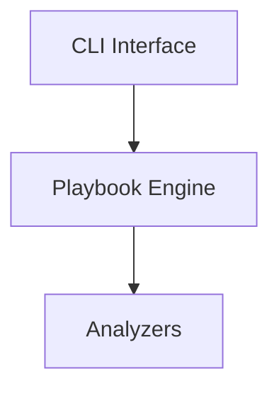

# Project-Specific Rules & Extensions

This document extends the base agent rules with project-specific standards and conventions.

## Overview

Your project combines:
- **Python backend** (CLI tool for image analysis)
- **Template-based reporting** (Jinja2 HTML)
- **CI/CD automation** (GitHub Actions, Release Please)
- **Documentation** (Docusaurus, memory bank)
- **Architecture**: Analyzers, playbooks, schema validation

The following rules are **in addition to** the base standards in `rules/`.

---

## Package Manager

**Use [pipenv](https://pipenv.pypa.io/en/latest) exclusively**

```bash
# Install dependencies
pipenv install

# Install dev dependencies
pipenv install --dev

# Run in pipenv environment
pipenv run python -m cli

# Create lock file (commit to version control)
pipenv lock
```

- `Pipfile` tracks direct dependencies with flexible versions
- `Pipfile.lock` ensures reproducible builds
- Both must be committed to git
- Never use `pip` directly; use `pipenv`

---

## Commit Message Scopes

Your project has **defined scopes** to enable clean, readable changelogs.

### Core & Logic

| Scope | Description |
|-------|-------------|
| `cli` | Command-line interface, argument parsing, console output |
| `playbook` | Rule evaluation engine, section parsing, jsonLogic, context |
| `schema` | Data interfaces, structure definition, JSON schema files |
| `registry` | Registry communication (HTTP, auth, manifest fetching) |

### Analyzers

| Scope | Description |
|-------|-------------|
| `analyzer` | Base analyzer class or shared analyzer interfaces |
| `analyzer/trivy` | Vulnerability scanning and SBOM via Trivy |
| `analyzer/sbom` | SBOM analysis and CycloneDX/SPDX generation |
| `analyzer/hadolint` | Dockerfile linting |
| `analyzer/skopeo` | Base image metadata extraction |
| `analyzer/freshness` | Image age and freshness scores |
| `analyzer/size` | Size and layer calculations |
| `analyzer/popularity` | Registry popularity metrics |
| `analyzer/endoflife` | Version support status |
| `analyzer/scorecarddev` | OpenSSF Scorecard checks |
| `analyzer/provenance` | Provenance and supply chain evidence |

### Rendering & Reporting

| Scope | Description |
|-------|-------------|
| `report` | Report generation logic (folder, file writing) |
| `templates` (or `theme`) | HTML structure, CSS, Jinja2 macros |

### Tooling & CI

| Scope | Description |
|-------|-------------|
| `ci` | GitHub Actions workflows (Super-Linter, Release Please) |
| `deps` (or `build`) | Environment (Pipenv, pyproject.toml, Dockerfiles) |
| `docs` | Docusaurus docs, READMEs, memory bank updates |

### Examples

```
feat(cli): add --filter-by-severity flag
fix(analyzer/trivy): handle missing vulnerability data
feat(templates): add dark mode CSS
chore(deps): upgrade Trivy to v0.48
docs(memory-bank): document analyzer architecture
```

**All commits must use one of these scopes.** If your change doesn't fit, create a new scope and document it here.

---

## Documentation

### Structure

```
docs/
├── memory-bank/          ← Updated after major changes
├── architecture/         ← System design & diagrams
├── analyzers/           ← Analyzer-specific docs
├── api/                 ← API/schema documentation
└── README.md            ← Getting started, quick links

README.md (root)         ← Brief intro, links to docs/
```

### Tools & Formats

- **Docusaurus** for documentation (not Docusaurus)
- **Mermaid** for diagrams (C4 format preferred)
- **Google Style Guide** for writing: https://developers.google.com/style
- **Memory bank** updated after significant changes

### Memory Bank

The memory bank (`docs/memory-bank/`) documents:
- Architectural decisions
- Important patterns and why they exist
- Known issues and workarounds
- Current status of major components

**Update after:**
- Major refactors
- New analyzer additions
- Schema changes
- Significant bug fixes

---

## CI / CD

### GitHub Actions

- Use **GitHub Actions** for CI/CD (no other runners)
- Integrate **Release Please** for semantic versioning and changelogs
- Enforce **Semantic Versioning** (semver.org)
- Use **Super Linter** for code quality checks

### Workflows

```yaml
# Key workflows
.github/workflows/
├── lint.yml              ← Super Linter, Ruff, mypy
├── test.yml              ← pytest with coverage
└── release.yml           ← Release Please automation
```

### Release Process

1. Merge PRs to `main`
2. Release Please creates/updates a release PR automatically
3. Review the changelog
4. Merge the release PR
5. Release Please publishes to GitHub Releases
6. Update memory bank if needed

**Never manually edit Release Please PRs** unless absolutely necessary.

### Configuration as Code

Use [GitHub Settings App](https://github.com/apps/settings) to manage:
- Branch protection rules
- PR requirements
- Status checks
- Team permissions

Configuration stored in `.github/settings.yml` (synced to repository settings).

---

## Code Quality Tools

### Super Linter

Runs automatically on every PR:
- **Ruff** (Python formatting + linting)
- **mypy** (type checking)
- **yamllint** (YAML validation)
- **Markdown** linting
- And more...

**Check Super Linter results in every PR.** Fix issues before merge.

### Development Setup

```bash
# Install all tools
pipenv install --dev

# Run all checks locally
./scripts/lint.sh

# Format code
ruff format .

# Type check
mypy src/

# Run tests
pytest --cov=src
```

---

## Diagram Guidelines

### Preferred Format

Use **C4 model** for architecture diagrams:
- **C1**: System context
- **C2**: Container diagram
- **C3**: Component diagram
- **C4**: Code (class diagrams, etc.)

### Implementation

Use **Mermaid** for all diagrams:



Store diagrams in `docs/diagrams/` with `.mmd` extension.

---

## Development Containers

**Use devcontainers** where possible.

```bash
# In VS Code
# Open Command Palette → "Dev Containers: Reopen in Container"

# Or via CLI
devcontainer open .
```

Devcontainer config: `.devcontainer/devcontainer.json`

Ensures:
- Consistent environment across team
- All dependencies available
- No "works on my machine" issues

---

## Python Specifics (Your Project)

### Styleguide

Follow [Google Python Style Guide](https://google.github.io/styleguide/pyguide.html) + our base rules.

### Tools Configuration

All in `pyproject.toml`:

```toml
[tool.ruff]
line-length = 88
target-version = "py310"

[tool.mypy]
python_version = "3.10"
strict = true
```

### Type Hints

- **Mandatory** on all new functions and classes
- Use Python 3.10+ syntax: `list[T]`, `str | None`
- Target 100% mypy coverage for new code

### Testing

- Framework: `pytest`
- Coverage: Minimum 80% (100% for analyzers)
- Run: `pipenv run pytest --cov=src`

---

## Git Workflow

### Simple Feature Flow (Small Team)

```
main (production)
  ↑
  └─ feature/x (merged via PR)
```

**Rules:**
- `main` branch is protected
- **All changes via PR** (no direct pushes)
- PR review required before merge
- Pass all CI checks before merge

### Branch Naming

```
feature/add-analyzer-x
fix/issue-123-null-pointer
chore/upgrade-trivy
docs/memory-bank-update
```

---

## Code Philosophy

### Prefer Established Solutions

- Use existing, state-of-the-art libraries over building from scratch
- Prefer well-known libraries (proven, community support)
- Document why you chose a particular library

### Language Preference

- **Prefer Python** over ECMAScript/JavaScript when possible
- Avoid JavaScript unless specifically needed for frontend/templating
- Python is the project's primary language

---

## Checklist Before Commit

For **every commit**, verify:

```bash
# 1. Code quality
ruff format .
ruff check .
mypy src/
pytest --cov=src

# 2. Commit message format
# Type: feat, fix, docs, style, refactor, perf, test, chore
# Scope: One of the defined scopes (see above)
# Subject: Present tense, < 72 chars, functional

# 3. Documentation
# - Memory bank updated? (if major change)
# - Comments explain "why"?

# 4. Tests
# - New functions tested?
# - Coverage target met (80%+)?

# 5. Then push
git push origin feature/my-feature
```

---

## Integration with Base Rules

This document extends, not replaces, the base rules in `rules/`.

When there's a conflict:
1. **Project-specific rules take precedence** for your project
2. Base rules apply everywhere else not specified here
3. Document any exceptions or overrides

Example: Base says "Ruff line length 88" → Your project: Same ✅

---

## Examples

### Good Commit

```
feat(analyzer/freshness): add configurable image age threshold

Users can now set custom thresholds for freshness scoring via
the --age-threshold flag. Defaults to 365 days.

Closes #234
Related: architecture/scoring-system.md
```

### Good PR

- Title: `feat(cli): add --filter-by-severity flag`
- Description: Explains what, why, test plan
- Passes all CI checks
- Memory bank updated if needed
- 2+ reviewers approve

### Good Code

```python
# mypy: strict (100% typed)
# Ruff: passed formatting
# pytest: 85%+ coverage
# Scope: analyzer/freshness

def calculate_freshness_score(
    image_created: datetime,
    threshold_days: int = 365
) -> float:
    """Calculate image freshness score (0.0 to 1.0).

    Args:
        image_created: Image creation timestamp
        threshold_days: Days threshold for "fresh" image

    Returns:
        Freshness score where 1.0 = very fresh

    Note:
        See docs/scoring-system.md for details
    """
```

---

**This document is living.** Update it when:
- Adding new analyzers (add scope)
- Changing tools or processes
- Discovering better practices

Last updated: 2026-03-31
