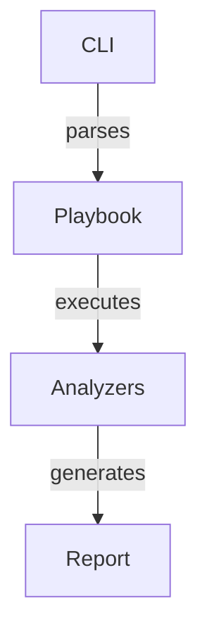

# Documentation Standards

## Documentation as Code

Documentation is treated as code: versioned, reviewed, tested, and maintained alongside your project.

### Tools

- **Framework**: Docusaurus (not Antora)
- **Format**: Markdown files
- **Version Control**: Git (same repository)
- **Review**: Documentation changes go through code review

## Repository Structure

```
your-project/
├── docs/
│   ├── docusaurus.config.js        # Docusaurus configuration
│   ├── sidebars.js                 # Navigation structure
│   ├── src/
│   │   ├── pages/                  # Top-level pages
│   │   └── components/             # Reusable React components
│   │
│   ├── docs/                       # Documentation sections
│   │   ├── getting-started/
│   │   │   ├── installation.md
│   │   │   └── quickstart.md
│   │   ├── guides/
│   │   │   ├── architecture.md
│   │   │   ├── contributing.md
│   │   │   └── testing.md
│   │   ├── api/
│   │   │   └── reference.md
│   │   ├── analyzers/
│   │   │   ├── overview.md
│   │   │   └── analyzer-name.md
│   │   │
│   │   └── memory-bank/            # Living documentation
│   │       ├── decisions.md        # ADRs
│   │       ├── patterns.md         # Design patterns
│   │       ├── known-issues.md     # Gotchas & workarounds
│   │       └── status.md           # Project status
│   │
│   └── static/
│       ├── diagrams/               # Mermaid diagrams (C4 format)
│       ├── images/
│       └── downloads/

└── README.md                        # Brief project intro (see below)
```

## README.md (Root)

The root README should be **brief** and link to detailed documentation:

```markdown
# Project Name

One-sentence description of what it does.

## Quick Links

- 📖 [Installation Guide](docs/getting-started/installation.md)
- 🚀 [Quick Start](docs/getting-started/quickstart.md)
- 🏗️ [Architecture](docs/guides/architecture.md)
- 🧪 [Testing Guide](docs/guides/testing.md)
- 📚 [Full Documentation](docs)

## Status

Brief project status (stable, experimental, etc.)

## Contributing

[See CONTRIBUTING.md](docs/guides/contributing.md)

## License

MIT
```

**Never** put detailed documentation in the root README. Link to detailed docs instead.

## Memory Bank

The memory bank (`docs/memory-bank/`) is **living documentation** maintained after significant changes.

### When to Update

Update the memory bank after:
- **Major refactors** — Document why and what changed
- **New analyzers** — Document the approach and architecture
- **Schema changes** — Document the evolution of data structures
- **Significant bug fixes** — Document the issue and solution
- **Architectural decisions** — Document the decision and trade-offs

### What to Document

**decisions.md** — Architecture Decision Records (ADRs)
```markdown
# ADR-001: Use Pipenv for Dependency Management

## Context
Need consistent, reproducible builds across team

## Decision
Use Pipenv for all Python dependency management

## Consequences
- All team members must use Pipenv (not pip)
- Both Pipfile and Pipfile.lock committed to git
- Faster onboarding with consistent environments
```

**patterns.md** — Design patterns and conventions
```markdown
# Analyzer Pattern

All analyzers:
1. Inherit from `BaseAnalyzer`
2. Implement `analyze(image)` → `AnalysisResult`
3. Include comprehensive logging
4. Raise domain-specific exceptions

See `src/analyzers/base.py` for implementation template.
```

**known-issues.md** — Known issues and workarounds
```markdown
# Known Issues

## Trivy CVE Database Slow on First Run
**Issue**: First run of Trivy analyzer takes 2-3 minutes
**Cause**: Database initialization
**Workaround**: Pre-warm database on deployment
**Timeline**: Will improve in Trivy v0.49
```

**status.md** — Project status and roadmap
```markdown
# Project Status

## Current Release: v1.2.0

### In Progress
- Multi-architecture image support
- SLSA provenance verification

### Planned
- Kubernetes security scanning
- Container registry integration

### Maintenance
- Regular dependency updates
- CVE database sync daily
```

## Docusaurus Configuration

### docusaurus.config.js

```javascript
module.exports = {
  title: 'Project Name',
  tagline: 'One-line description',
  url: 'https://docs.example.com',
  baseUrl: '/',

  presets: [
    [
      '@docusaurus/preset-classic',
      {
        docs: {
          sidebarPath: require.resolve('./sidebars.js'),
          editUrl: 'https://github.com/your-org/project/edit/main/docs/',
        },
        theme: {
          customCss: require.resolve('./src/css/custom.css'),
        },
      },
    ],
  ],

  themeConfig: {
    navbar: {
      title: 'Project Name',
      logo: {
        alt: 'Logo',
        src: 'img/logo.svg',
      },
      items: [
        {to: 'docs', label: 'Docs', position: 'left'},
        {href: 'https://github.com/your-org/project', label: 'GitHub', position: 'right'},
      ],
    },
  },
};
```

### sidebars.js

```javascript
module.exports = {
  docs: [
    'intro',
    {
      label: 'Getting Started',
      items: [
        'getting-started/installation',
        'getting-started/quickstart',
      ],
    },
    {
      label: 'Guides',
      items: [
        'guides/architecture',
        'guides/testing',
        'guides/contributing',
      ],
    },
    {
      label: 'Analyzers',
      items: [
        'analyzers/overview',
        'analyzers/trivy',
        'analyzers/sbom',
      ],
    },
    {
      label: 'Memory Bank',
      items: [
        'memory-bank/decisions',
        'memory-bank/patterns',
        'memory-bank/known-issues',
      ],
    },
  ],
};
```

## Writing Documentation

Follow [Google Style Guide](https://developers.google.com/style):

- **Clear, concise language** — Avoid jargon without explanation
- **Active voice** — "The CLI processes images" not "Images are processed by the CLI"
- **Second person** — "You can run" not "One can run"
- **Specific examples** — Show, don't tell

### Markdown Best Practices

```markdown
# Heading 1 (Page title, one per file)

## Heading 2 (Major sections)

### Heading 3 (Subsections)

**Bold** for important concepts
`code` for inline code
```markdown
code blocks
```

> Block quotes for tips and warnings

**Tips:**
```markdown
> **Tip:** Use pipenv sync for reproducible installs
```

**Warnings:**
```markdown
> **Warning:** Never commit secrets (API keys, tokens)
```
```

## Diagrams

Use **Mermaid** for all diagrams.

Store in `docs/static/diagrams/` with `.mmd` extension:



## Documentation Review

Documentation changes go through code review like code:

**Checklist for reviewers:**
- [ ] Content is accurate
- [ ] Grammar and spelling correct
- [ ] Links work and are relevant
- [ ] Examples run without errors
- [ ] Matches Google Style Guide tone
- [ ] Memory bank updated if significant change

## Keeping Docs in Sync

### Update After Code Changes

When you modify code:

1. **Update documentation** in the same commit
2. **Update examples** if they change behavior
3. **Update memory bank** if architectural change
4. **Add to changelog** in `docs/memory-bank/status.md`

### Regular Reviews

**Weekly**: Check for broken links, outdated examples
**Monthly**: Review memory bank for completeness
**Quarterly**: Update architecture diagrams if needed

## Building & Previewing

```bash
# Install dependencies
npm install

# Start local development server
npm start

# Build static site
npm build

# Serve production build
npm serve
```

## Deployment

Docusaurus sites are static and can be deployed to:
- GitHub Pages
- Netlify
- Vercel
- Any static hosting

Example GitHub Pages deployment:

```bash
# Build and deploy
npm run build
npm run serve

# Or via GitHub Actions (recommended)
# See .github/workflows/docs.yml
```

---

**Remember**: Documentation is as important as code. Keep it accurate, up-to-date, and clear. Your future self (and team members) will thank you!
